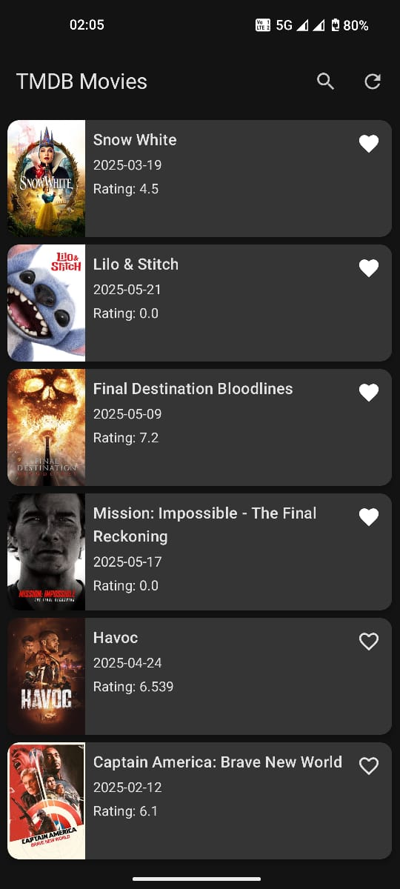
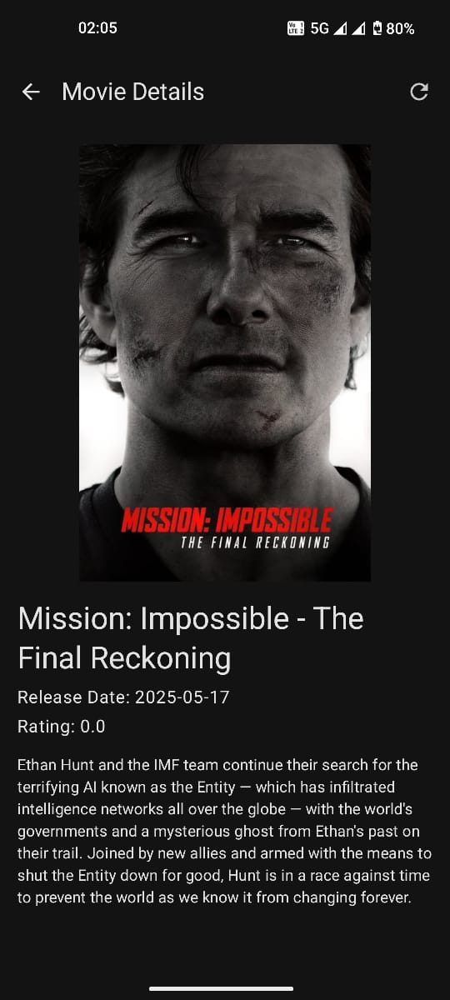
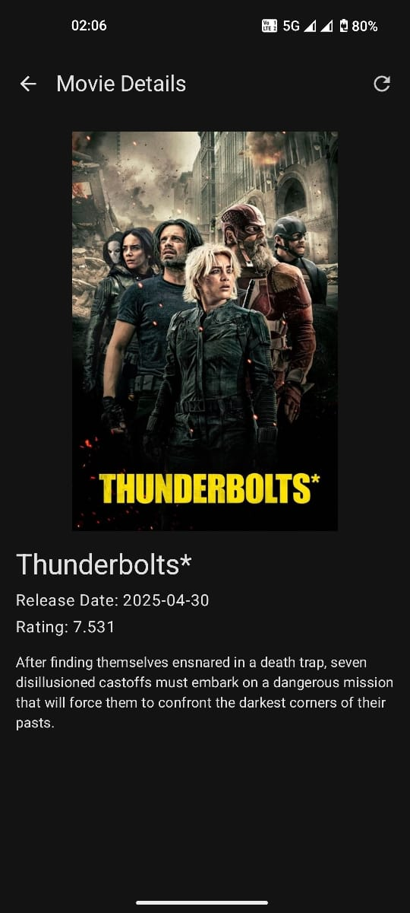

# 🎬 TMDB App - Jetpack Compose

A modern Android app built with **Jetpack Compose** that displays movies from **TMDB (The Movie Database)**. It includes offline support using **RoomDB**, network calls via **Retrofit**, and adheres to Jetpack best practices.

---

## ✨ Features

- 🖼️ Browse popular movies from TMDB
- 🔍 Search for movies
- 🗃️ Local caching with RoomDB
- 📡 Network integration with Retrofit
- 🌐 Works offline with cached data
- 📱 Jetpack Compose UI

---
## ⚠️ Network Issue Note

**Having trouble fetching movie data?**

Please try to **run the app using mobile data**.

In some cases, `tmdb.org` might be **blocked or filtered on certain Wi-Fi networks**, which prevents the app from accessing the TMDB API.

---

## 📷 Screenshots

  
  
  

---

## 🧰 Tech Stack

- **Kotlin**
- **Jetpack Compose**
- **Retrofit**
- **Room Database**
- **Coroutines + Flow**
- **MVVM Architecture**

